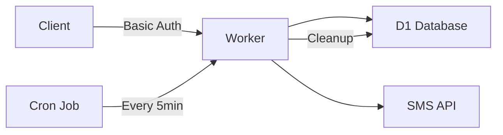

# 📱 Mobile OTP Verification Worker

<div align="center">


**Generate • Send • Verify** — A secure OTP service built on Cloudflare Workers

[Features](#-features) • [Quick Start](#-quick-start) • [API](#-api-reference) • [Configuration](#️-configuration) • [Security](#-security)

</div>

---

## 📑 Table of Contents

- [Overview](#-overview)
- [Features](#-features)
- [Quick Start](#-quick-start)
- [Database Setup](#️-database-setup)
- [Configuration](#️-configuration)
- [API Reference](#-api-reference)
- [Testing](#-testing)
- [Security](#-security)
- [Monitoring](#-monitoring)

---

## 🎯 Overview

A **production-ready** Cloudflare Worker that handles mobile OTP (One-Time Password) verification with enterprise-grade security and reliability. Perfect for telco porting, user verification, and secure authentication flows.

### 🏗️ Architecture



---

## ✨ Features

<table>
<tr>
<td width="50%">

### 🔐 Security
- ✅ **Basic Authentication** on all endpoints
- ✅ **7-digit secure OTPs** (never starts with 0)
- ✅ **Rate limiting** (2 attempts max)
- ✅ **10-minute expiry** window

</td>
<td width="50%">

### ⚡ Performance
- ✅ **Edge deployment** via Cloudflare
- ✅ **D1 SQL database** for fast queries
- ✅ **Automatic cleanup** via cron
- ✅ **Audit trail** for compliance

</td>
</tr>
</table>

---

## 🚀 Quick Start

### Prerequisites
- Cloudflare account with Workers enabled
- D1 database created
- SMS provider credentials (SMS API)

### 1️⃣ Clone and Deploy

```bash
# Clone the worker code
git clone https://github.com/Nafis28/simpleOTPService

# Deploy to Cloudflare
wrangler deploy
```

### 2️⃣ Configure (see [Configuration](#️-configuration))

### 3️⃣ Test the API

```bash
# Request an OTP
curl -X POST "https://your-worker.workers.dev/request" \
  -u "username:password" \
  -H "Content-Type: application/json" \
  -d '{"Number":"+61412345678","LSP":"Telstra","OR":"ORDER1234"}'
```

---

## 🗄️ Database Setup

### Create D1 Database

1. **Navigate to:** Cloudflare Dashboard → Workers & Pages → D1
2. **Create database:** Name it `mobileotp`
3. **Run this schema:**

```sql
-- 🏗️ Create OTP storage table
CREATE TABLE IF NOT EXISTS otps (
  number TEXT PRIMARY KEY,          -- Mobile in E.164 format
  code TEXT NOT NULL,               -- 7-digit OTP
  lsp TEXT,                         -- Service provider
  order_ref TEXT,                   -- Order reference
  failed_attempts INTEGER NOT NULL DEFAULT 0,
  created_at INTEGER NOT NULL,      -- Unix timestamp
  status TEXT DEFAULT 'pending'     -- Status: pending|success|failed
);

-- 🚀 Add performance index
CREATE INDEX IF NOT EXISTS idx_otps_created_at 
ON otps(created_at);
```

### 📊 Database States

| Status | Description | Retention |
|--------|------------|-----------|
| 🟡 `pending` | OTP sent, awaiting verification | 10 minutes |
| 🟢 `success` | OTP verified successfully | Permanent* |
| 🔴 `failed` | Max attempts exceeded | Permanent* |

*Consider adding cleanup for old success/failed records

---

## ⚙️ Configuration

### 🔗 D1 Database Binding

<details>
<summary><b>Click to expand setup instructions</b></summary>

1. Go to Worker → **Settings** → **Bindings**
2. Click **"+ Add Binding"**
3. Select **D1 Database**
4. Configure:
   - Variable name: `DB`
   - Database: `mobileotp`

</details>

### 🔑 Environment Secrets

| Secret | Description | Example |
|--------|------------|---------|
| `BASIC_USER` | Basic auth username | `otp_service` |
| `BASIC_PASS` | Basic auth password | `SecureP@ss123!` |
| `SMS_TOKEN` | SMS API bearer token | `abc123xyz789` |
| `SMS_FROM` | Sender ID/number | `VERIFY` or `+61400000000` |

> ⚠️ **Important:** Add these via **Settings → Variables → Secrets** (not plain variables!)

### ⏰ Cron Schedule

```yaml
Schedule: "*/5 * * * *"  # Every 5 minutes
Purpose: Clean expired pending OTPs
```

<details>
<summary><b>Setup Instructions</b></summary>

1. Go to Worker → **Triggers** → **Cron Triggers**
2. Add trigger with expression: `*/5 * * * *`
3. Save and verify it's active

</details>

---

## 📡 API Reference

### 🔒 Authentication

All requests require **Basic Authentication**:

```http
Authorization: Basic base64(username:password)
```

### Endpoints

#### 📤 **POST** `/request` — Send OTP

<details open>
<summary><b>Request Body</b></summary>

```json
{
  "Number": "+61412345678",  // E.164 format required
  "LSP": "Telstra",          // Losing service provider
  "OR": "ORDER1234"          // Order reference
}
```

</details>

<details>
<summary><b>Response Examples</b></summary>

**✅ Success (200)**
```json
{
  "status": "sent"
}
```

**❌ Error (400/500)**
```json
{
  "error": "Invalid number format"
}
```

</details>

---

#### ✔️ **POST** `/otp` — Verify OTP

<details open>
<summary><b>Request Body</b></summary>

```json
{
  "Number": "+61412345678",
  "code": "1234567"
}
```

</details>

<details>
<summary><b>Response Examples</b></summary>

**✅ Correct Code (200)**
```json
{
  "status": "success"
}
```

**⚠️ Wrong Code - First Attempt (400)**
```json
{
  "error": "Incorrect code. Try again.",
  "attempts_left": 1
}
```

**❌ Wrong Code - Final Attempt (400)**
```json
{
  "error": "Incorrect code. Attempts exhausted; request a new code."
}
```

**⏰ Expired OTP (400)**
```json
{
  "error": "OTP expired"
}
```

</details>

---

## 🧪 Testing

### Using cURL

<details>
<summary><b>Request OTP</b></summary>

```bash
curl -X POST "https://your-worker.workers.dev/request" \
  -u "BASIC_USER:BASIC_PASS" \
  -H "Content-Type: application/json" \
  -d '{
    "Number": "+61412345678",
    "LSP": "Telstra",
    "OR": "ORDER1234"
  }'
```

</details>

<details>
<summary><b>Verify OTP</b></summary>

```bash
curl -X POST "https://your-worker.workers.dev/otp" \
  -u "BASIC_USER:BASIC_PASS" \
  -H "Content-Type: application/json" \
  -d '{
    "Number": "+61412345678",
    "code": "1234567"
  }'
```

</details>

### Using Postman

1. **Method:** `POST`
2. **URL:** `https://your-worker.workers.dev/[endpoint]`
3. **Auth Tab:** Type = Basic Auth
4. **Body:** Raw JSON (see examples above)

### 🧑‍💻 Development Testing

```javascript
// Local testing with Wrangler
wrangler dev --local --persist

// View D1 data
wrangler d1 execute mobileotp --command "SELECT * FROM otps"
```

---

## 🔐 Security

### Best Practices Implemented

| Feature | Implementation | Benefit |
|---------|---------------|---------|
| 🔑 **Authentication** | Basic Auth on all endpoints | Prevents unauthorized access |
| 🎲 **OTP Generation** | 7 digits, no leading zeros | Secure & user-friendly |
| ⏱️ **Time Limits** | 10-minute expiry | Reduces attack window |
| 🚫 **Rate Limiting** | Max 2 attempts per OTP | Prevents brute force |
| 📝 **Audit Trail** | All attempts logged | Compliance & debugging |
| 🔒 **Secrets Management** | Environment variables | No hardcoded credentials |

### 🛡️ Security Checklist

- [ ] Use HTTPS only (automatic with Workers)
- [ ] Rotate `BASIC_PASS` regularly
- [ ] Monitor failed attempts
- [ ] Use E.164 format for all numbers
- [ ] Consider adding IP-based rate limiting
- [ ] Implement webhook for suspicious activity

---

## 📈 Monitoring

### Key Metrics to Track

```sql
-- 📊 Daily OTP statistics
SELECT 
  DATE(created_at, 'unixepoch') as date,
  COUNT(*) as total_otps,
  SUM(CASE WHEN status = 'success' THEN 1 ELSE 0 END) as successful,
  SUM(CASE WHEN status = 'failed' THEN 1 ELSE 0 END) as failed
FROM otps
GROUP BY date
ORDER BY date DESC
LIMIT 7;
```

### 🚨 Alerts to Configure

- High failure rate (>20%)
- Unusual traffic patterns
- Cron job failures
- SMS API errors

---

## 📝 License

This project is licensed under the MIT License.

---

<div align="center">

### 💡 Need Help?

[Documentation](https://developers.cloudflare.com/workers/) • [Community](https://community.cloudflare.com/) • [Support](https://support.cloudflare.com/)

**Built with ❤️ on Cloudflare Workers**

</div>
